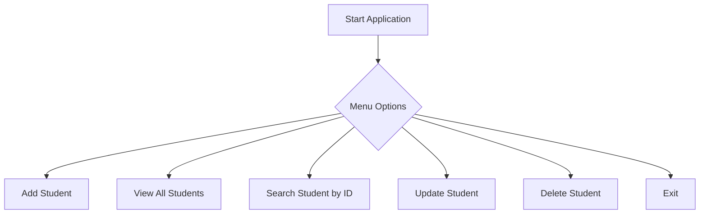

# 📘 Student Management System - Java & JDBC

A **simple console-based Java application** that demonstrates CRUD (Create, Read, Update, Delete) operations for managing student records using **JDBC** and **MySQL**.

---

## 📂 Project Structure

```
├── DaoInterface.java
├── JdbcUtils.java
├── Student.java
├── StudentDao.java
└── Student_Project.java
```

---

## ✅ Features

- Add new student
- View all students
- Search student by ID
- Update student details
- Delete student by ID

---

## 🧱 Tech Stack

- **Java SE**
- **JDBC**
- **MySQL**
- **Command Line Interface (CLI)**

---

## 🛠️ Setup Instructions

1. **Clone the repository**  
   ```bash
   git clone https://github.com/yourusername/student-management-system.git
   cd student-management-system
   ```

2. **Set up MySQL database**  
   Run the following SQL script to create the required table:

   ```sql
   CREATE DATABASE sms;
   USE sms;

   CREATE TABLE students (
       id INT PRIMARY KEY,
       name VARCHAR(50),
       age INT,
       email VARCHAR(50),
       course VARCHAR(50)
   );
   ```

3. **Update database credentials**  
   In `JdbcUtils.java`, update:
   ```java
   String url = "jdbc:mysql://localhost:3306/sms";
   String userId = "root";
   String password = "your_password";
   ```

4. **Compile and Run the project**
   ```bash
   javac School/*.java
   java School.Student_Project
   ```

---

## 🗂️ Application Flow



---

## 🖼️ Sample Output

```
********Student Managment System************
1)Add Student
2)View All Student
3)Search Student By Id
4)Update Student
5)Delete Student
6)Exit
Enter your choice:
```

---

## 📌 Notes

- This is a basic educational project for learning purposes.
- Password and DB credentials are hardcoded — for real applications, consider using environment variables or config files.
- The code follows a DAO pattern for clean separation between logic and persistence layers.

---

## 👨‍💻 Abhijeet Tilekar

- **Abhijeet Tilekar** — (https://github.com/tilekarabhi70)
